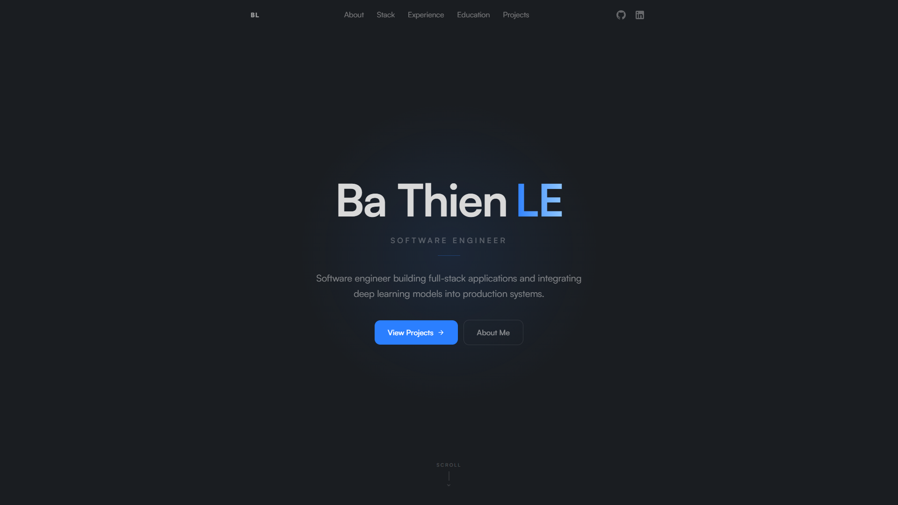

# bathienle.github.io

<div align="center">

[![GitHub Action Publish][github-publish-badge]][github-publish-url]
[![GitHub Action CI][github-ci-badge]][github-ci-url]
[![GitHub License][license-badge]][license-url]



</div>

[bathienle.github.io](https://bathienle.github.io/) is my portfolio website, showcasing my work, skills, and experience as a Software Engineer.

This portfolio is a continuously evolving side project where I try to explore and integrate the latest trends in web development.

## Built With

- [Vue 3](https://vuejs.org/) - Progressive JavaScript framework
- [TypeScript](https://www.typescriptlang.org/) - Typed JavaScript
- [Tailwind CSS](https://tailwindcss.com/) - Utility-first CSS framework
- [Vite](https://vite.dev/) - Frontend build tool

## Prerequisites

- [Node.js](https://nodejs.org/) 24+

## Project Setup

```sh
npm install
```

### Compile and Hot-Reload for Development

```sh
npm run dev
```

### Compile and Minify for Production

```sh
npm run build
```

### Preview Production Build

```sh
npm run preview
```

### Lint

```sh
npm run lint
```

### Run Unit Tests with [Vitest](https://vitest.dev/)

```sh
npm run test:unit
```

## Licence

[Apache-2.0][license-url]

[license-badge]: https://img.shields.io/github/license/bathienle/bathienle.github.io
[license-url]: https://github.com/bathienle/bathienle.github.io/blob/main/LICENSE
[github-publish-badge]: https://github.com/bathienle/bathienle.github.io/workflows/Publish/badge.svg
[github-publish-url]: https://github.com/bathienle/bathienle.github.io/actions/workflows/publish.yaml
[github-ci-badge]: https://github.com/bathienle/bathienle.github.io/workflows/CI/badge.svg
[github-ci-url]: https://github.com/bathienle/bathienle.github.io/actions/workflows/ci.yaml
